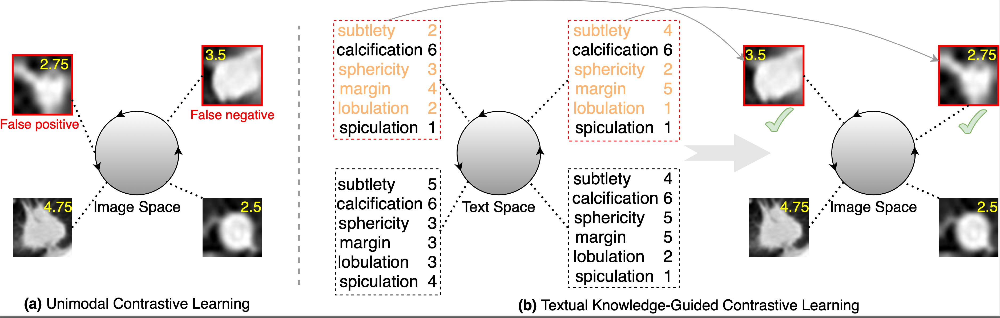

# CLIP-Lung
This repository is about the paper ``[CLIP-Lung: Textual Knowledge-Guided Lung Nodule Malignancy Prediction](https://doi.org/10.1007/978-3-031-43990-2_38)'' published at MICCAI 2023.



## Dataset
Please customize your own Class of Dataset. In our implementation, the `__getitem__` function returns a triplet of image tensor, class label, and attribute weights.


# Training
```
bash run.sh
```

# Citation

If you find the code useful for your research, please consider citing
```bib
@inproceedings{
  lei2023cliplung,
  title={CLIP-Lung: Textual Knowledge-Guided Lung Nodule Malignancy Prediction},
  author={Lei Yiming and Li Zilong and Shen Yan and Zhang Junping and Shan Hongming},
  booktitle={Medical Image Computing and Computer Assisted Intervention -- MICCAI 2023},
  year={2023},
  pages={403--412}
}
```

